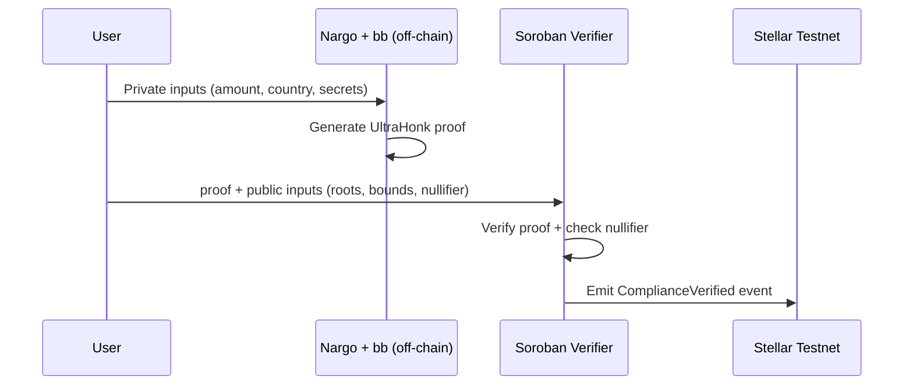

# ZK Remittance Compliance Layer

**Prove cross-border remittance compliance without revealing identity, amount, or location — verified on Stellar Soroban via UltraHonk ZK proofs.**

Built for hackathons. Honest about what's production-ready vs. demo-simplified.

---

## Problem

Pakistan receives **$30B+** in annual remittances. Stellar powers cross-border stablecoin payments, but compliance today requires **full data exposure**:

- Sender identity linked to every transfer
- Exact amounts visible to intermediaries
- Jurisdiction/location data shared across parties

This creates privacy risk for diaspora senders and friction for payment providers.

## Solution

A **zero-knowledge compliance layer** where users prove:

1. ✅ They are **NOT** on a sanctions list
2. ✅ Transfer amount is **within legal thresholds**
3. ✅ Jurisdiction is **in an allowed corridor**

…while keeping address hash, amount, and country **private**. Proofs verify **on-chain** on Stellar Soroban; nullifiers prevent replay.

## How It Works



```
┌──────────────┐    ZK Proof     ┌─────────────────────┐
│ Private Data │ ──────────────► │ Soroban Verifier    │
│ (never sent) │  public only:   │ (Stellar Testnet)   │
│ • amount     │  • merkle roots │                     │
│ • country    │  • thresholds   │  ✅ Compliant       │
│ • identity   │  • nullifier    └─────────────────────┘
└──────────────┘
```

## Tech Stack

| Layer | Technology |
|-------|------------|
| ZK Circuit | [Noir](https://noir-lang.org/) (latest stable) |
| Proof System | UltraHonk (Barretenberg `bb`) |
| On-chain Verifier | Stellar Soroban (Rust) via [rs-soroban-ultrahonk](https://github.com/NethermindEth/rs-soroban-ultrahonk) |
| Network | Stellar Testnet |
| Merkle Trees | Node.js + arithmetic hash (guaranteed Noir parity) |
| Frontend | Vanilla HTML/JS + Freighter wallet |

## Architecture

```
zk-remittance/
├── circuits/compliance/     ← Noir ZK circuit (core)
├── contracts/verifier/      ← Soroban compliance + UltraHonk verifier
├── merkle/build_tree.js     ← Sanctions + jurisdiction Merkle trees
├── scripts/                 ← Proof gen, deploy, submit
├── frontend/                ← Demo UI (Freighter + Stellar SDK)
├── proofs/                  ← Generated proof artifacts
└── demo_inputs.json         ← Sample test inputs
```

## ZK Circuit Explanation

### What's proven (simultaneously)

| Constraint | Method | Private | Public |
|------------|--------|---------|--------|
| Not on sanctions list | Sorted Merkle **exclusion** proof (adjacent neighbors) | sender hash, neighbor paths | sanctions root |
| Amount in range | `min ≤ amount ≤ max` | amount | min/max thresholds |
| Jurisdiction allowed | Merkle **membership** proof | jurisdiction hash, path | jurisdictions root |
| No replay | `nullifier = hash_pair(secret, nonce)` | secret, nonce | nullifier |

### What's hidden

- Exact transfer amount
- Country/jurisdiction code
- Sender address (only hash used in circuit)
- Merkle paths and secrets

### What's revealed (public inputs)

- Sanctions list Merkle root
- Min/max amount thresholds
- Allowed jurisdictions Merkle root
- Nullifier (prevents double-spend of the same proof)

---

## Setup & Installation

### Prerequisites

```bash
# 1. Rust + WASM target
curl --proto '=https' --tlsv1.2 -sSf https://sh.rustup.rs | sh
rustup target add wasm32v1-none

# 2. Stellar CLI (v3.2+)
cargo install --locked stellar-cli

# 3. Noir + Barretenberg
curl -L https://raw.githubusercontent.com/noir-lang/noirup/main/install | bash
noirup

curl -L https://raw.githubusercontent.com/AztecProtocol/aztec-packages/master/barretenberg/cpp/installation/install | bash
bbup

# 4. Node.js 18+
node --version

# 5. Freighter wallet browser extension (for frontend demo)
# https://www.freighter.app/
```

### Install project dependencies

```bash
cd zk-remittance
cd merkle && npm install && cd ..
```

---

## Running Locally (Step by Step)

### 1. Build Merkle trees

```bash
cd merkle
node build_tree.js
cd ..
```

Generates `merkle/merkle_data.json` and `demo_inputs.json`.

### 2. Generate ZK proof

```bash
# Git Bash / WSL / macOS / Linux:
bash scripts/generate_proof.sh
```

This will:
- Populate `circuits/compliance/Prover.toml`
- Run `nargo check`, `nargo compile`, `nargo execute`
- Run `bb prove` + `bb write_vk` + `bb verify`
- Copy artifacts to `proofs/`

> **Note:** `nargo prove` / `nargo verify` were removed in Noir 1.0. We use `bb prove` / `bb verify` instead.

### 3. Deploy contract to testnet

```bash
bash scripts/deploy_contract.sh
```

Saves `CONTRACT_ID` to `.env`.

### 4. Submit proof on-chain

```bash
bash scripts/submit_proof.sh
```

### 5. Frontend demo

```bash
# Serve frontend (any static server)
cd frontend
npx serve .
# Open http://localhost:3000
```

1. Connect Freighter (switch to **Testnet**)
2. Click **Load Demo Artifacts**
3. Paste your **Contract ID** from `.env`
4. Click **Generate Proof & Verify**

---

## Testnet Deployment

```bash
export STELLAR_NETWORK_NAME=testnet
bash scripts/generate_proof.sh
bash scripts/deploy_contract.sh
bash scripts/submit_proof.sh
```

Ensure your Freighter account has testnet XLM.

---

## What's Mocked / Known Limitations

We are **honest** about demo simplifications:

| Area | Demo behavior | Production need |
|------|---------------|-----------------|
| Sanctions list | 20 hardcoded fake hashes | Real OFAC/sanctions feed, frequent updates |
| Jurisdictions | 10 hardcoded ISO codes | Dynamic policy per corridor/regulator |
| Address hashing | Simplified Poseidon hash of address string | Standardized identity commitment scheme |
| Hash parity | `hashPair` in JS vs `hash_pair` in Noir | Arithmetic hash (guaranteed parity) — swap for Poseidon in production |
| Proof generation | Off-chain CLI only (not in-browser WASM) | Browser prover or prover service |
| Sorted Merkle exclusion | Correct pattern, static tree | Incremental updates, larger depth |
| `nargo prove` | Not available in Noir 1.0 | Use `bb prove` (as we do) |
| Instance storage nullifiers | Demo-friendly | Persistent storage + TTL extension at scale |

**The cryptography is real** (Noir circuit + UltraHonk + Soroban verifier). The **data sources are mock** for hackathon demo purposes.

---

## Future Work

- [ ] Real-time sanctions oracle integration (Chainlink, custom feed)
- [ ] Regulator dashboard for Merkle root updates
- [ ] In-browser proving via NoirJS + bb WASM
- [ ] Multi-asset threshold proofs
- [ ] Relayer for gasless submission (privacy-preserving)
- [ ] Formal audit of circuit + contract
- [ ] Mainnet deployment with legal review

---

## Team

Built for the Stellar hackathon. Replace with your team names and contact info.

---

## References

- [Noir Language](https://noir-lang.org/)
- [Barretenberg (bb)](https://github.com/AztecProtocol/aztec-packages/tree/master/barretenberg)
- [rs-soroban-ultrahonk](https://github.com/NethermindEth/rs-soroban-ultrahonk)
- [Stellar Soroban Docs](https://developers.stellar.org/docs/build/smart-contracts)
- [Freighter Wallet](https://www.freighter.app/)

## License

MIT
